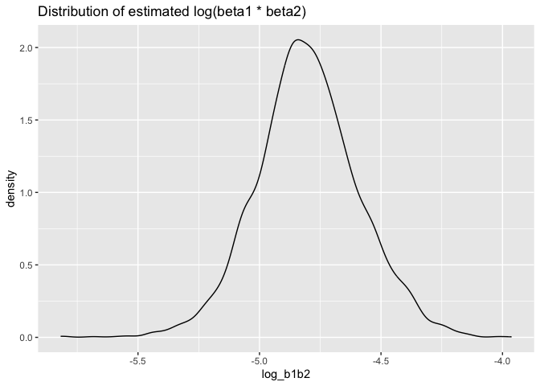

P8105_HW6_YX2953
================
Vivian Xia
2024-12-01

``` r
# Load required libraries
library(dplyr)
```

    ## 
    ## Attaching package: 'dplyr'

    ## The following objects are masked from 'package:stats':
    ## 
    ##     filter, lag

    ## The following objects are masked from 'package:base':
    ## 
    ##     intersect, setdiff, setequal, union

``` r
library(tidyverse)
```

    ## ── Attaching core tidyverse packages ──────────────────────── tidyverse 2.0.0 ──
    ## ✔ forcats   1.0.0     ✔ readr     2.1.5
    ## ✔ ggplot2   3.5.1     ✔ stringr   1.5.1
    ## ✔ lubridate 1.9.3     ✔ tibble    3.2.1
    ## ✔ purrr     1.0.2     ✔ tidyr     1.3.1

    ## ── Conflicts ────────────────────────────────────────── tidyverse_conflicts() ──
    ## ✖ dplyr::filter() masks stats::filter()
    ## ✖ dplyr::lag()    masks stats::lag()
    ## ℹ Use the conflicted package (<http://conflicted.r-lib.org/>) to force all conflicts to become errors

``` r
library(tidyr)
library(ggplot2)
library(purrr)
library(broom)
library(knitr)
library(modelr)
```

    ## 
    ## Attaching package: 'modelr'
    ## 
    ## The following object is masked from 'package:broom':
    ## 
    ##     bootstrap

``` r
library(rsample)
library(p8105.datasets)
```

Problem 1

``` r
weather_df = 
  rnoaa::meteo_pull_monitors(
    c("USW00094728"),
    var = c("PRCP", "TMIN", "TMAX"), 
    date_min = "2017-01-01",
    date_max = "2017-12-31") %>%
  mutate(
    name = recode(id, USW00094728 = "CentralPark_NY"),
    tmin = tmin / 10,
    tmax = tmax / 10) %>%
  select(name, id, everything())
```

    ## using cached file: /Users/jiaowen/Library/Caches/org.R-project.R/R/rnoaa/noaa_ghcnd/USW00094728.dly

    ## date created (size, mb): 2024-12-02 18:07:08.23972 (8.667)

    ## file min/max dates: 1869-01-01 / 2024-11-30

``` r
bootstrap_results <- weather_df %>%
  modelr::bootstrap(n = 5000) %>%
  mutate(
    models = map(strap, \(df) lm(tmax ~ tmin + prcp, data = df)),
    summary = map(models, broom::glance),
    results = map(models, broom::tidy)) %>%
  select(-models) %>%
  unnest(summary, results) %>% 
  select(id = .id, r.squared, term, estimate) %>% 
  pivot_wider(
    names_from = term,
    values_from = estimate) %>% 
  mutate(
    abs_prcp = abs(prcp),
    log_b1b2 = log(tmin * abs_prcp)
  ) %>% 
  select(id, r.squared, log_b1b2)
```

    ## Warning: `unnest()` has a new interface. See `?unnest` for details.
    ## ℹ Try `df %>% unnest(c(summary, results))`, with `mutate()` if needed.

``` r
bootstrap_results %>%
  ggplot(aes(x = r.squared)) + geom_density() + 
  labs(title = "Distribution of estimated r square")
```

<!-- -->

``` r
LB_r = bootstrap_results %>% 
  pull(r.squared) %>%
  quantile(0.025)
UB_r =bootstrap_results %>%
  pull(r.squared) %>%
  quantile(0.975)

c(LB_r, UB_r)%>%
  knitr::kable(digits = 3)
```

|       |     x |
|:------|------:|
| 2.5%  | 0.900 |
| 97.5% | 0.932 |

The distribution shows a mild left-skew with its center approximately at
0.918. The lower and upper bounds of its 95% confidence interval, marked
by the 2.5% and 97.5% quantiles, are 0.9 and 0.932. This interval can be
denoted as (0.9, 0.932).

``` r
bootstrap_results %>%
  filter(log_b1b2 != "NaN") %>%
  ggplot(aes(x = log_b1b2)) + geom_density() + labs(title = "Distribution of estimated log(beta1 * beta2)")
```

<!-- -->

``` r
LB_b = bootstrap_results %>%
  filter(log_b1b2 != "NaN") %>%
  pull(log_b1b2) %>%
  quantile(0.025)

UB_b =bootstrap_results %>%
  filter(log_b1b2 != "NaN") %>% 
  pull(log_b1b2) %>%
  quantile(0.975)

c(LB_b, UB_b) %>%
  knitr::kable(digits = 3)
```

|       |      x |
|:------|-------:|
| 2.5%  | -5.219 |
| 97.5% | -4.374 |

The distribution of is a left-skew, centering around -5.5. The
distribution’s 2.5% and 97.5% quantiles are -5.219 and -4.374,
respectively, defining a 95% confidence interval represented as (-5.219,
-4.374).

Problem 2

``` r
# Load and clean data
homicide_df <- read_csv(file = "data/homicide-data 2.csv", na = c("Unknown", "NA", "")) %>%
  mutate(
    reported_date = as.Date(as.character(reported_date), format = "%Y%m%d"),
    city_state = str_c(city, state, sep = ", "),
    solved = if_else(disposition == "Closed by arrest", 1, 0),
    victim_age = as.numeric(victim_age)
  ) %>%
  
# Filter out specified cities and races
filter(
  !city_state %in% c("Dallas, TX", "Phoenix, AZ", "Kansas City, MO", "Tulsa, AL"),
  victim_race %in% c("White", "Black")
  )
```

    ## Rows: 52179 Columns: 12
    ## ── Column specification ────────────────────────────────────────────────────────
    ## Delimiter: ","
    ## chr (8): uid, victim_last, victim_first, victim_race, victim_sex, city, stat...
    ## dbl (4): reported_date, victim_age, lat, lon
    ## 
    ## ℹ Use `spec()` to retrieve the full column specification for this data.
    ## ℹ Specify the column types or set `show_col_types = FALSE` to quiet this message.

``` r
# Logistic regression for Baltimore, MD
baltimore_df <- homicide_df %>%
  filter(city_state == "Baltimore, MD")

# Fit logistic regression model
logistic_model <- glm(solved ~ victim_age + victim_sex + victim_race, 
                      data = baltimore_df, family = binomial())

# Extract results for victim_sexMale and compute Odds Ratio
logistic_model_results <- logistic_model %>%
  broom::tidy(conf.int = TRUE) %>%
  filter(term == "victim_sexMale") %>%
  mutate(
    OR = exp(estimate),
    CI_low = exp(conf.low),
    CI_high = exp(conf.high)
  ) %>%
  select(OR, CI_low, CI_high)

# Display results in a table
logistic_model_results %>% 
  kable(digits = 3, col.names = c("Odds Ratio (OR)", "95% CI Lower", "95% CI Upper"))
```

| Odds Ratio (OR) | 95% CI Lower | 95% CI Upper |
|----------------:|-------------:|-------------:|
|           0.426 |        0.324 |        0.558 |

The estimate and confidence interval of the adjusted odds ratio for
solving homicides comparing male victims to female victims keeping all
other variables fixed is 0.426 and \[0.324,0.558\].

``` r
# Logistic regression for all cities
city_models <- homicide_df %>%
  group_by(city_state) %>%
  nest() %>%
  # Apply logistic regression to each city
  mutate(
    model = map(data, ~ glm(solved ~ victim_age + victim_sex + victim_race, 
                            data = ., family = binomial())),
    results = map(model, ~ broom::tidy(.x, conf.int = TRUE) %>%
                    filter(term == "victim_sexMale") %>%
                    mutate(
                      OR = exp(estimate),
                      CI_low = exp(conf.low),
                      CI_high = exp(conf.high)
                    ) %>%
                    select(OR, CI_low, CI_high))
  ) %>%
  unnest(results) %>%
  select(city_state, OR, CI_low, CI_high)

# Display city-wise results in a table
city_models %>% 
  kable(digits = 3, col.names = c("City, State", "Odds Ratio (OR)", "95% CI Lower", "95% CI Upper"))
```

| City, State        | Odds Ratio (OR) | 95% CI Lower | 95% CI Upper |
|:-------------------|----------------:|-------------:|-------------:|
| Albuquerque, NM    |           1.767 |        0.825 |        3.762 |
| Atlanta, GA        |           1.000 |        0.680 |        1.458 |
| Baltimore, MD      |           0.426 |        0.324 |        0.558 |
| Baton Rouge, LA    |           0.381 |        0.204 |        0.684 |
| Birmingham, AL     |           0.870 |        0.571 |        1.314 |
| Boston, MA         |           0.667 |        0.351 |        1.260 |
| Buffalo, NY        |           0.521 |        0.288 |        0.936 |
| Charlotte, NC      |           0.884 |        0.551 |        1.391 |
| Chicago, IL        |           0.410 |        0.336 |        0.501 |
| Cincinnati, OH     |           0.400 |        0.231 |        0.667 |
| Columbus, OH       |           0.532 |        0.377 |        0.748 |
| Denver, CO         |           0.479 |        0.233 |        0.962 |
| Detroit, MI        |           0.582 |        0.462 |        0.734 |
| Durham, NC         |           0.812 |        0.382 |        1.658 |
| Fort Worth, TX     |           0.669 |        0.394 |        1.121 |
| Fresno, CA         |           1.335 |        0.567 |        3.048 |
| Houston, TX        |           0.711 |        0.557 |        0.906 |
| Indianapolis, IN   |           0.919 |        0.678 |        1.241 |
| Jacksonville, FL   |           0.720 |        0.536 |        0.965 |
| Las Vegas, NV      |           0.837 |        0.606 |        1.151 |
| Long Beach, CA     |           0.410 |        0.143 |        1.024 |
| Los Angeles, CA    |           0.662 |        0.457 |        0.954 |
| Louisville, KY     |           0.491 |        0.301 |        0.784 |
| Memphis, TN        |           0.723 |        0.526 |        0.984 |
| Miami, FL          |           0.515 |        0.304 |        0.873 |
| Milwaukee, wI      |           0.727 |        0.495 |        1.054 |
| Minneapolis, MN    |           0.947 |        0.476 |        1.881 |
| Nashville, TN      |           1.034 |        0.681 |        1.556 |
| New Orleans, LA    |           0.585 |        0.422 |        0.812 |
| New York, NY       |           0.262 |        0.133 |        0.485 |
| Oakland, CA        |           0.563 |        0.364 |        0.867 |
| Oklahoma City, OK  |           0.974 |        0.623 |        1.520 |
| Omaha, NE          |           0.382 |        0.199 |        0.711 |
| Philadelphia, PA   |           0.496 |        0.376 |        0.650 |
| Pittsburgh, PA     |           0.431 |        0.263 |        0.696 |
| Richmond, VA       |           1.006 |        0.483 |        1.994 |
| San Antonio, TX    |           0.705 |        0.393 |        1.238 |
| Sacramento, CA     |           0.669 |        0.326 |        1.314 |
| Savannah, GA       |           0.867 |        0.419 |        1.780 |
| San Bernardino, CA |           0.500 |        0.166 |        1.462 |
| San Diego, CA      |           0.413 |        0.191 |        0.830 |
| San Francisco, CA  |           0.608 |        0.312 |        1.155 |
| St. Louis, MO      |           0.703 |        0.530 |        0.932 |
| Stockton, CA       |           1.352 |        0.626 |        2.994 |
| Tampa, FL          |           0.808 |        0.340 |        1.860 |
| Tulsa, OK          |           0.976 |        0.609 |        1.544 |
| Washington, DC     |           0.691 |        0.466 |        1.014 |

``` r
# Step 4: Plot results for all cities
city_models %>%
  ggplot(aes(x = reorder(city_state, OR), y = OR)) +
  geom_point(size = 3, color = "blue") +
  geom_errorbar(aes(ymin = CI_low, ymax = CI_high), width = 0.2, color = "darkgray") +
  geom_hline(yintercept = 1, linetype = "dashed", color = "red", size = 1) +
  labs(
    title = "Odds Ratios for Solving Homicides by City",
    subtitle = "Comparison of Male vs Female Victims",
    x = "City, State",
    y = "Odds Ratio (Male vs Female Victims)"
  ) +
  theme_minimal() +
  theme(
    axis.text.x = element_text(angle = 90, hjust = 1),
    plot.title = element_text(size = 16, face = "bold"),
    plot.subtitle = element_text(size = 12),
    axis.title.x = element_text(size = 12),
    axis.title.y = element_text(size = 12)
  )
```

    ## Warning: Using `size` aesthetic for lines was deprecated in ggplot2 3.4.0.
    ## ℹ Please use `linewidth` instead.
    ## This warning is displayed once every 8 hours.
    ## Call `lifecycle::last_lifecycle_warnings()` to see where this warning was
    ## generated.

<!-- --> The
plot above displays the estimated odds ratios (ORs) and their confidence
intervals for solving homicides, comparing male victims to female
victims, across cities. Cities are organized by their ORs, showing the
variation in how victim sex is associated with homicide resolution
rates. An OR less than 1 indicates a lower likelihood of solving
homicides for male victims compared to female victims and significant
variation exists across cities, suggesting local factors may influence
these outcomes.

Problem 3

``` r
# Load the dataset
birthweight <- read_csv("data/birthweight.csv")
```

    ## Rows: 4342 Columns: 20
    ## ── Column specification ────────────────────────────────────────────────────────
    ## Delimiter: ","
    ## dbl (20): babysex, bhead, blength, bwt, delwt, fincome, frace, gaweeks, malf...
    ## 
    ## ℹ Use `spec()` to retrieve the full column specification for this data.
    ## ℹ Specify the column types or set `show_col_types = FALSE` to quiet this message.

``` r
# Convert appropriate columns to factors
birthweight <- birthweight %>%
  mutate(
    babysex = as.factor(babysex),
    frace = as.factor(frace),
    mrace = as.factor(mrace),
    malform = as.factor(malform)
)
```

``` r
# Fit the proposed regression model
model1 <- lm(bwt ~ blength + bhead + gaweeks + delwt + ppbmi + smoken + malform, data = birthweight)

# Summarize the model
summary(model1)
```

    ## 
    ## Call:
    ## lm(formula = bwt ~ blength + bhead + gaweeks + delwt + ppbmi + 
    ##     smoken + malform, data = birthweight)
    ## 
    ## Residuals:
    ##      Min       1Q   Median       3Q      Max 
    ## -1089.65  -184.98    -7.36   175.61  2476.27 
    ## 
    ## Coefficients:
    ##               Estimate Std. Error t value Pr(>|t|)    
    ## (Intercept) -6040.3726    98.1387 -61.549  < 2e-16 ***
    ## blength        77.3456     2.0703  37.360  < 2e-16 ***
    ## bhead         134.9309     3.4787  38.788  < 2e-16 ***
    ## gaweeks        14.1394     1.4851   9.521  < 2e-16 ***
    ## delwt           3.6161     0.2883  12.544  < 2e-16 ***
    ## ppbmi         -14.2528     1.9531  -7.297 3.47e-13 ***
    ## smoken         -2.4803     0.5800  -4.276 1.94e-05 ***
    ## malform1       30.7525    72.6493   0.423    0.672    
    ## ---
    ## Signif. codes:  0 '***' 0.001 '**' 0.01 '*' 0.05 '.' 0.1 ' ' 1
    ## 
    ## Residual standard error: 280.7 on 4334 degrees of freedom
    ## Multiple R-squared:  0.7002, Adjusted R-squared:  0.6997 
    ## F-statistic:  1446 on 7 and 4334 DF,  p-value: < 2.2e-16

``` r
# Add residuals and predictions
birthweight <- birthweight %>%
  add_predictions(model1, var = "fitted") %>%
  add_residuals(model1, var = "residuals")

# Plot residuals vs. fitted values
ggplot(birthweight, aes(x = fitted, y = residuals)) +
  geom_point(alpha = 0.6) +
  geom_hline(yintercept = 0, color = "red", linetype = "dashed") +
  labs(
    title = "Residuals vs. Fitted Values",
    x = "Fitted Values",
    y = "Residuals"
  ) +
  theme_minimal()
```

<!-- -->

``` r
# Model 2: Length and gestational age as predictors
model2 <- lm(bwt ~ blength + gaweeks, data = birthweight)

# Model 3: Interactions between head circumference, length, and sex
model3 <- lm(bwt ~ bhead * blength * babysex, data = birthweight)
```

``` r
# Cross-validation setup
set.seed(123)
cv_split <- vfold_cv(birthweight, v = 5)

# Function to compute RMSE for each model
compute_rmse <- function(model, split) {
  train_data <- analysis(split)
  test_data <- assessment(split)
  fit <- lm(model, data = train_data)
  predictions <- predict(fit, newdata = test_data)
  rmse <- sqrt(mean((test_data$bwt - predictions)^2))
  return(rmse)
}

# Compute RMSE for each model
rmse_model1 <- map_dbl(cv_split$splits, ~ compute_rmse(bwt ~ blength + bhead + gaweeks + delwt + ppbmi + smoken + malform, .x))
rmse_model2 <- map_dbl(cv_split$splits, ~ compute_rmse(bwt ~ blength + gaweeks, .x))
rmse_model3 <- map_dbl(cv_split$splits, ~ compute_rmse(bwt ~ bhead * blength * babysex, .x))

# Combine RMSE results into a single dataframe for plotting
rmse_results <- tibble(
  Model = rep(c("Model 1 (Proposed)", "Model 2 (Length + Gestational Age)", "Model 3 (Interactions)"), each = length(rmse_model1)),
  RMSE = c(rmse_model1, rmse_model2, rmse_model3)
)
```

``` r
# Create a violin plot of RMSE for each model
ggplot(rmse_results, aes(x = Model, y = RMSE, fill = Model)) +
  geom_violin(trim = FALSE, alpha = 0.6) +
  geom_boxplot(width = 0.2, outlier.shape = NA, color = "black") +
  labs(
    title = "RMSE Distribution Across Models",
    subtitle = "Comparison of Cross-Validated RMSE for Different Models",
    x = "Model",
    y = "RMSE"
  ) +
  theme_minimal() +
  theme(
    legend.position = "none",
    axis.text.x = element_text(angle = 45, hjust = 1),
    plot.title = element_text(size = 16, face = "bold"),
    plot.subtitle = element_text(size = 12)
  )
```

<!-- -->
The violin plot provides a detailed visualization of the distribution of
RMSE (Root Mean Square Error) values across the different models
evaluated during cross-validation. Model 1 includes multiple predictors
like blength, bhead, gaweeks, etc. Model 2 focuses on blength and
gaweeks. Model 3 includes interactions between bhead, blength, and
babysex. Model Performance:Model 1 likely has the lowest median RMSE,
suggesting it performs better in predicting bwt compared to the others.
Model 2 has a slightly higher median RMSE, indicating it is less
accurate than Model 1 but likely simpler. Model 3 shows a wider spread
of RMSE values, suggesting variability in its performance.
